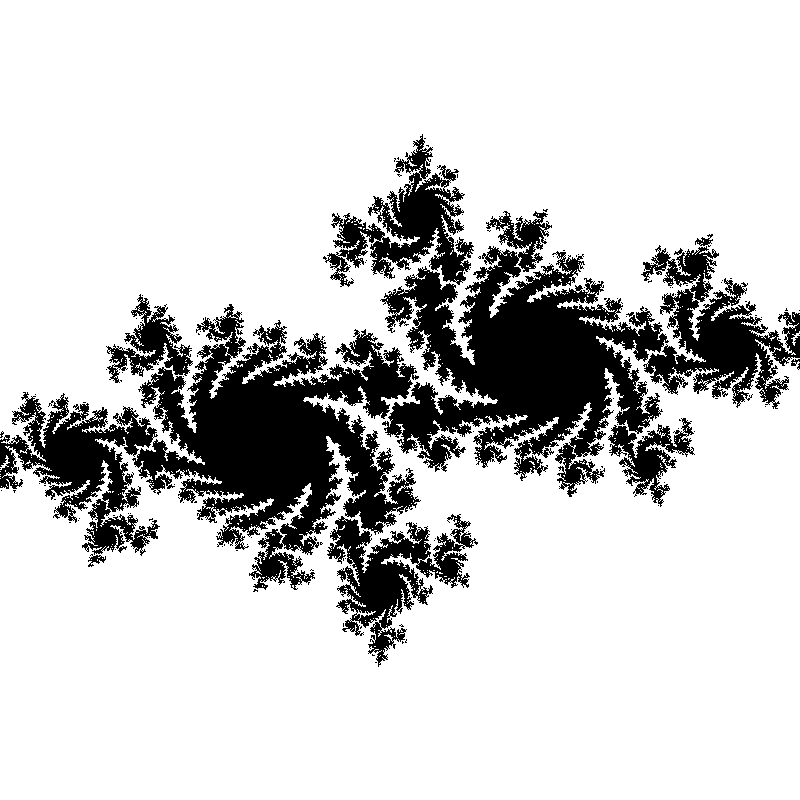

# Julia Set Generator

A Go application that generates beautiful Julia set fractal images.



## Overview

This project provides a simple way to generate Julia set fractals with customizable parameters. Julia sets are mathematically generated fractals that produce intricate and beautiful patterns based on complex number calculations.

## Installation

1. Make sure you have Go installed (1.22.x recommended)
2. Clone this repository

```bash
git clone https://github.com/ukhanseecs/Julia-Set-in-Go
```

## Usage

Run the application with default parameters:

```bash
go run main.go
```

This will generate a Julia set image named `julia.png` in the current directory.

## Customization

You can modify the following parameters in `main.go` to generate different Julia set patterns:

- `image_height` and `image_width`: Dimensions of the output image (default: 800x800 pixels)
- `maxIters`: Maximum number of iterations for each pixel (default: 100, higher values give more detail but slower)
- `scale`: Zoom level (default: 300.0, higher values zoom out)
- `juliaSetConstant`: Complex number that defines the particular Julia set (default: -0.7+0.27015i)

Example parameter combinations to try:

- `complex(-0.8, 0.156)` - Dendrite fractal
- `complex(-0.4, 0.6)` - San Marco fractal
- `complex(0.285, 0.01)` - Douady's rabbit fractal

## Project Structure

- `main.go` - Entry point and parameter configuration
- `fractal/` - Julia set mathematical calculations
- `imagegen/` - Image generation functions
- `fileutil/` - Utilities for saving images

## What is a Julia Set?

A Julia set is a mathematical fractal obtained from complex number calculations. For each point on the complex plane, the algorithm tests whether the sequence z₁, z₂, z₃, ... (where zₙ₊₁ = zₙ² + c) remains bounded after many iterations. The constant c determines the shape of the particular Julia set.

## License

[Your license information]
